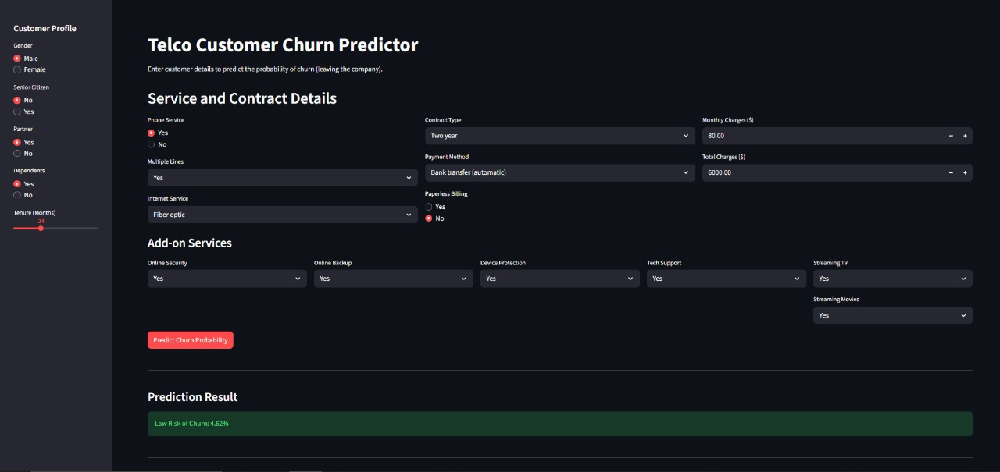

<p align="center">
  
</p>
#  Retention Rocket: Real-Time Churn Prediction (XGBoost & Streamlit)

## 📌 Overview
An end-to-end ML pipeline to predict customer churn in telecommunications.  
The model uses **XGBoost** with **SMOTE** for imbalance handling and is deployed in real-time using **Streamlit** + **pyngrok**.  

⚡ **Result:** Achieved **70% Recall** on churn class → helps flag 7/10 customers at risk of leaving.  

---

## 🚀 Features
- ✅ XGBoost model with **ImbPipeline (SMOTE)** for class imbalance  
- ✅ **70% Recall** on churn detection  
- ✅ Deployment via **Streamlit + pyngrok** for real-time scoring  
- ✅ Preprocessing with `ColumnTransformer` (`StandardScaler` + `OneHotEncoder`)  

---

## 📂 Files
```bash
├── WA_Fn-UseC_-Telco-Customer-Churn.csv   # Dataset
├── churn_prediction_model.pkl             # Trained model
├── train_columns.pkl                      # Column list
├── app.py                                 # Streamlit app
├── Churn_Prediction_Colab_Workflow.ipynb  # Training notebook
└── README.md
```

---

## ⚙️ Installation
```bash
pip install pandas numpy scikit-learn joblib xgboost imbalanced-learn streamlit pyngrok
```

---

## ▶️ Run on Colab
```python
from pyngrok import ngrok
import subprocess, time

ngrok.set_auth_token("YOUR_NGROK_AUTHTOKEN_HERE")
p = subprocess.Popen(['streamlit', 'run', 'app.py'])
time.sleep(5)
print("App URL:", ngrok.connect(8501))
```

---

## 💡 Insight
**70% Recall** = catches 7 out of 10 churners → strong tool for retention campaigns.  

---

## 👨‍💻 Author
**Mohamed Tarek**
